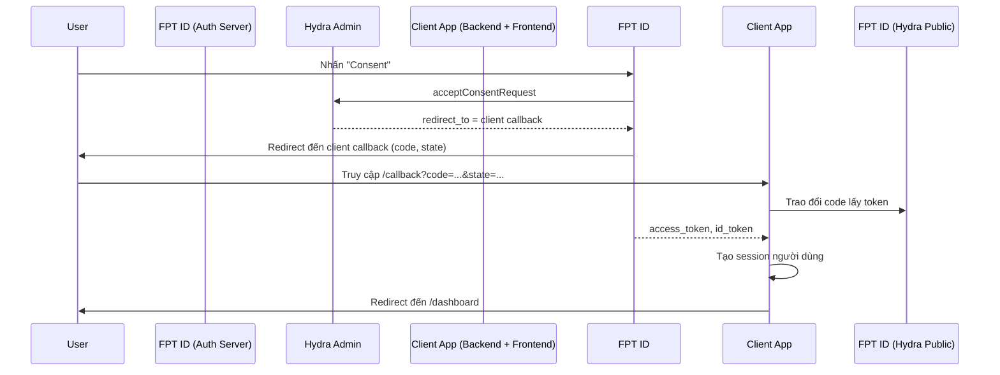

```mermaid
sequenceDiagram
  participant User
  participant FPT ID (Auth Server)
  participant Hydra Admin
  participant Client App (Backend + Frontend)

  User->>FPT ID: Nhấn "Consent"
  FPT ID->>Hydra Admin: acceptConsentRequest
  Hydra Admin-->>FPT ID: redirect_to = client callback
  FPT ID->>User: Redirect đến client callback (code, state)
  User->>Client App: Truy cập /callback?code=...&state=...
  Client App->>FPT ID (Hydra Public): Trao đổi code lấy token
  FPT ID-->>Client App: access_token, id_token
  Client App->>Client App: Tạo session người dùng
  Client App->>User: Redirect đến /dashboard
```
